---
## Author
author:
  name: бахи сиди али темассини
  degrees: Student (4 курс)
  orcid: ""
  email: 1032234211@rudn.ru
  affiliation:
    - name: Российский университет дружбы народов
      country: Российская Федерация
      postal-code: 117198
      city: Москва
      address: ул. Миклухо-Маклая, д. 6
## Title
title: Лабораторная работа №01
subtitle: "Моделирование сетей передачи данных"
license: CC BY
date: today
date-format: "YYYY-MM-DD" 
---

# Информация

## Докладчик

:::::::::::::: {.columns align=center}
::: {.column width="70%"}

  - бахи сиди али темассини
  - Российский университет дружбы народов

:::
::: {.column width="30%"}

:::
::::::::::::::

# Цель работы

- Изучить основные возможности среды Mininet.
- Создать простую сетевую топологию.
- Настроить IP-адреса хостов.
- Проверить связность между узлами.
- Освоить работу с графическим редактором MiniEdit.

# Выполнение лабораторной работы

## Запуск виртуальной машины Mininet

- Выполнен вход под пользователем `mininet`.
- Командой `ifconfig` проверены сетевые интерфейсы.
- Интерфейс `eth0`: `192.168.200.129`.
- Проверен локальный интерфейс `lo`.

{#fig-1 width=70%}

## Подключение по SSH

- Выполнено подключение с перенаправлением X11:
  `ssh -Y mininet@192.168.200.129`.
- Соединение с виртуальной машиной успешно установлено.

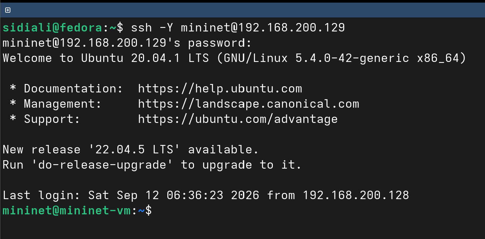{#fig-2 width=70%}

## Настройка SSH-ключа

- SSH-ключ скопирован командой `ssh-copy-id`.
- Повторное подключение выполнено с параметром `-Y`.
- Подключение выполнено без запроса пароля.

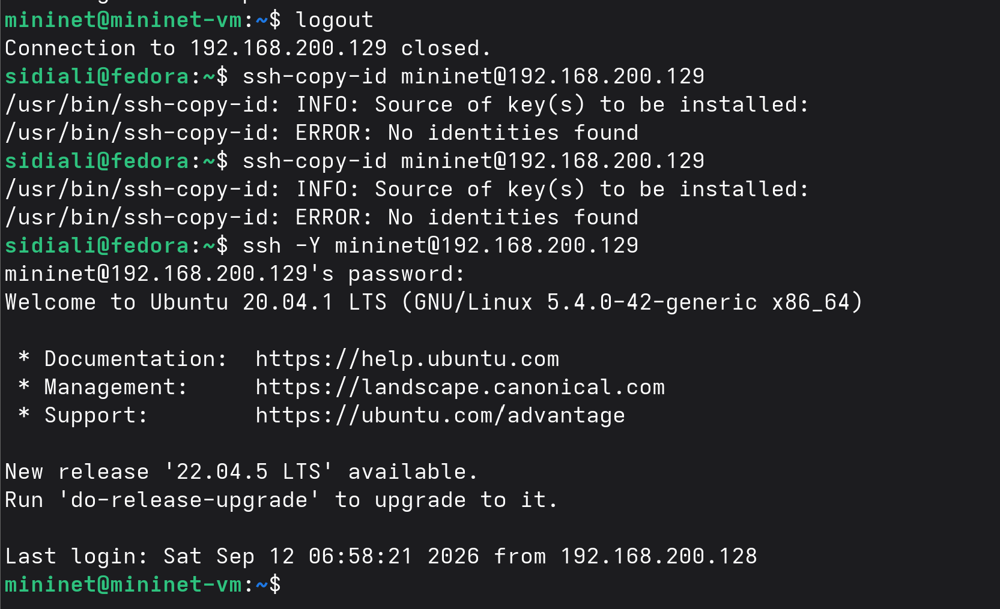{#fig-3 width=70%}

## Проверка сетевой конфигурации

- Повторно выполнена команда `ifconfig`.
- `eth0`: `192.168.200.129`.
- `lo`: `127.0.0.1`.

{#fig-4 width=70%}

## Настройка интерфейса eth1

- Запущен DHCP-клиент для `eth1`.
- Интерфейсу назначен адрес `192.168.100.128`.
- Подтверждена работа двух сетевых интерфейсов.

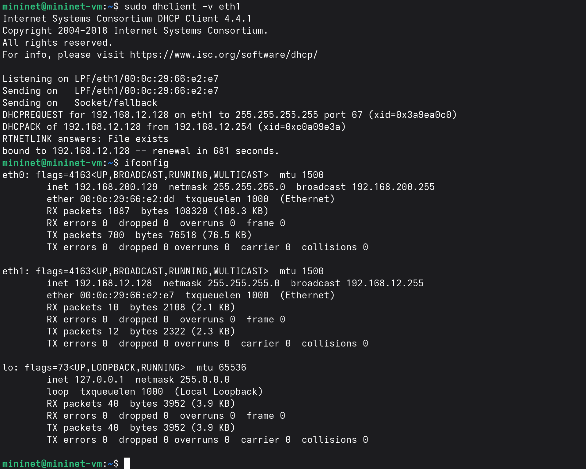{#fig-5 width=70%}

## Установка Midnight Commander

- Установлен файловый менеджер `mc`.
- Установка выполнена командой `sudo apt install mc`.
- Необходимые зависимости установлены успешно.

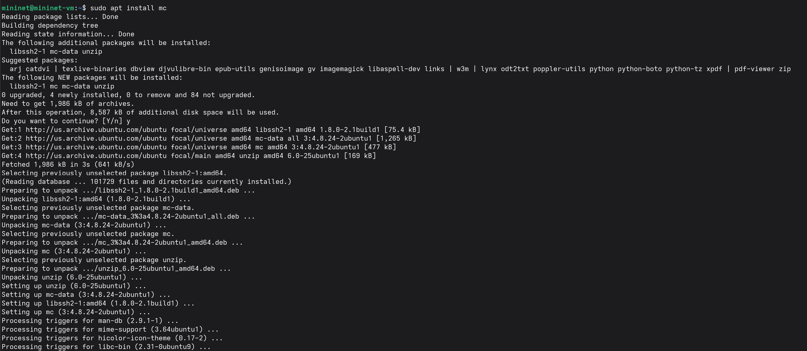{#fig-6 width=70%}

## Настройка Netplan

- Изменён файл `/etc/netplan/01-netcfg.yaml`.
- Для `eth0` и `eth1` включена автоматическая настройка IPv4 по DHCP.

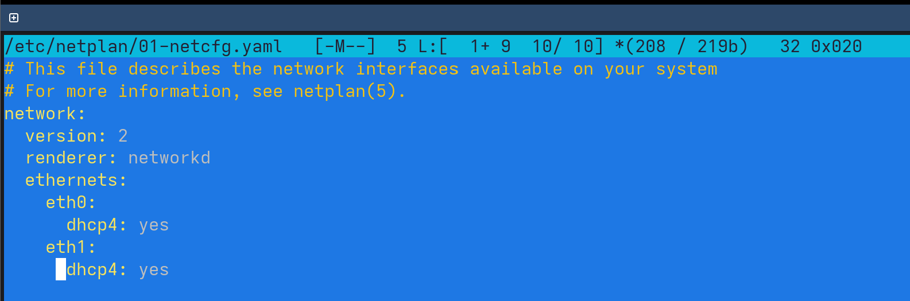{#fig-7 width=70%}

## Установка Mininet

- Исходный каталог переименован в `mininet.orig`.
- Исходный код Mininet клонирован повторно.
- Выполнена установка командой `sudo make install`.
- Версия Mininet: `2.3.1b4`.

---

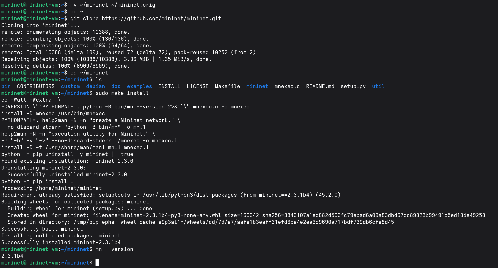{#fig-8 width=70%}

## Настройка терминала xterm

- В конфигурации `xterm` задан размер шрифта.
- Установлен параметр `xterm*faceSize: 12`.

{#fig-9 width=70%}

## Настройка X11-аутентификации

- Получено значение `MIT-MAGIC-COOKIE-1`.
- Значение добавлено для пользователя `root`.
- Настройка проверена командой `xauth list $DISPLAY`.

{#fig-10 width=70%}

## Запуск стандартной топологии Mininet

- Mininet запущен командой `sudo mn`.
- Созданы хосты `h1` и `h2`.
- Созданы коммутатор `s1` и контроллер `c0`.
- Командой `help` просмотрены доступные команды.

---

{#fig-11 width=70%}

## Проверка узлов и интерфейсов

- Командами `nodes` и `net` проверена топология.
- Хост `h1`: `10.0.0.1`.
- Хост `h2`: `10.0.0.2`.

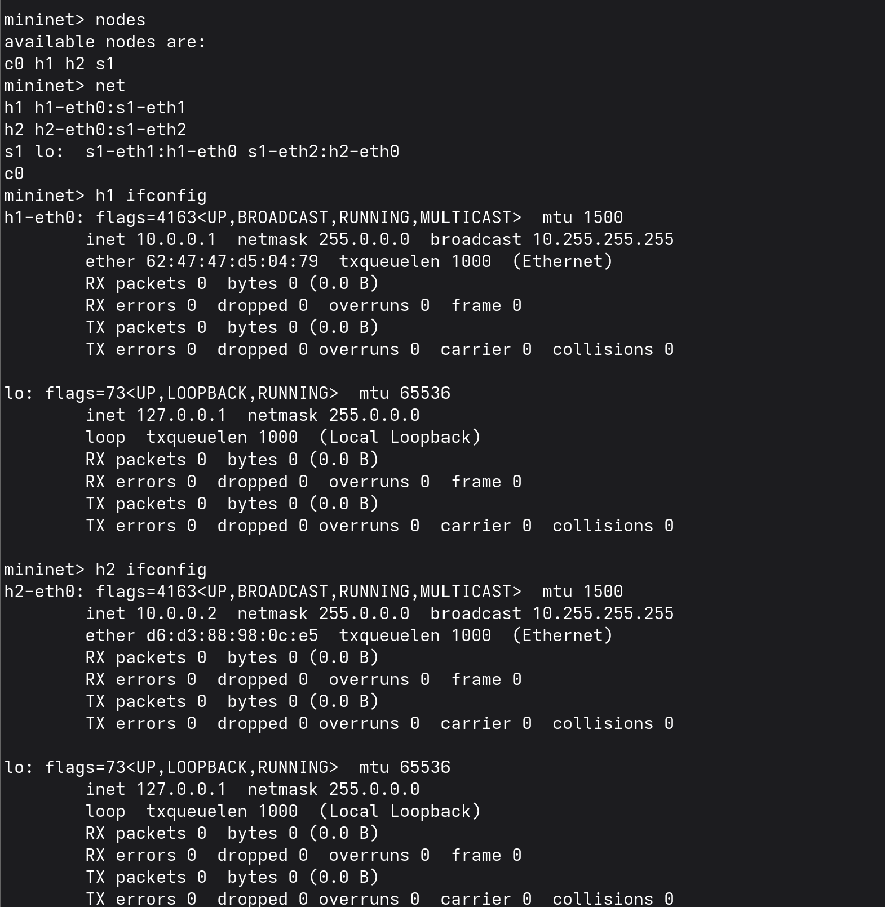{#fig-12 width=70%}

## Проверка связности хостов

- Выполнен `ping` между `h1` и `h2`.
- Передано и получено 5 пакетов.
- Потери пакетов: `0%`.
- RTT: `0.048/0.369/1.467/0.552` мс.
- Работа Mininet завершена командой `exit`.

---

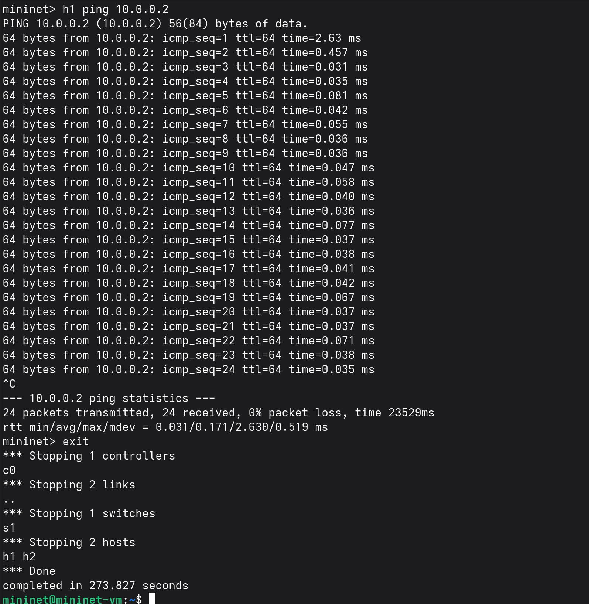{#fig-13 width=70%}

## Запуск MiniEdit

- Запущен графический редактор MiniEdit.
- Открыто рабочее окно с пустой топологией.

{#fig-14 width=70%}

## Создание топологии в MiniEdit

- Созданы два хоста: `h1` и `h2`.
- Добавлен коммутатор `s1`.
- Хосты соединены через коммутатор.

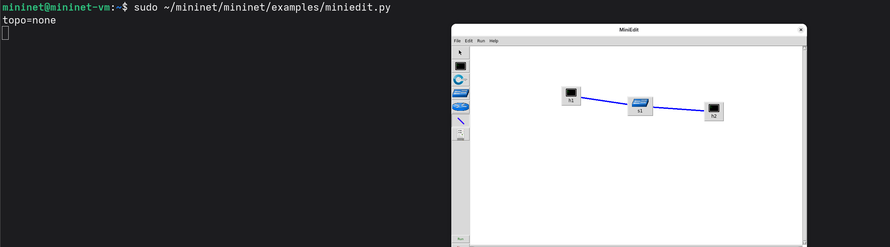{#fig-15 width=70%}

## Настройка IP-адреса h1

- Открыты свойства хоста `h1`.
- Задан IP-адрес `10.0.0.1/8`.

{#fig-16 width=70%}

## Настройка IP-адреса h2

- Открыты свойства хоста `h2`.
- Задан IP-адрес `10.0.0.2/8`.

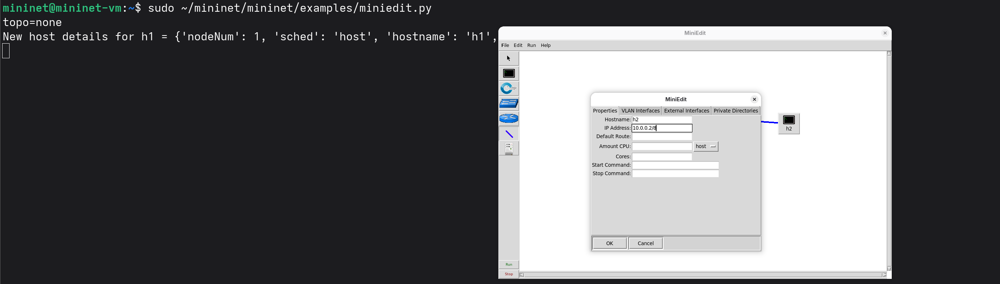{#fig-17 width=70%}

## Проверка топологии MiniEdit

- Запущена созданная топология.
- Проверены адреса командой `ifconfig`.
- Выполнен взаимный `ping` между `h1` и `h2`.
- Пакеты переданы без потерь.

---

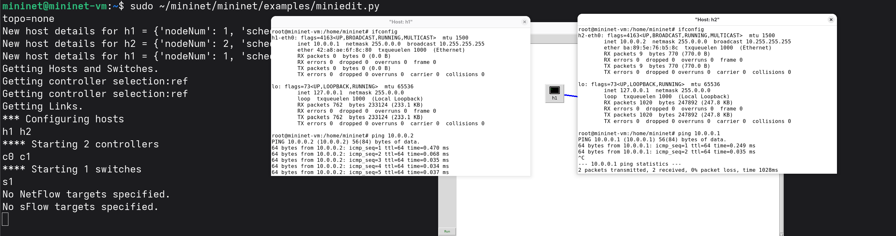{#fig-18 width=70%}

## Удаление IP-адресов хостов `h1`

- Удалён вручную заданный IP-адрес хоста `h1`.
- Поле `IP Address` оставлено пустым.

{#fig-19 width=70%}

## Удаление IP-адресов хостов `h2`

- Удалён вручную заданный IP-адрес хоста `h2`.
- Поле `IP Address` оставлено пустым.

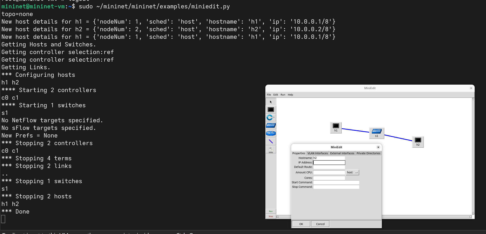{#fig-20 width=70%}

## Настройка IP Base

- В настройках MiniEdit изменён параметр `IP Base`.
- Задана базовая сеть `15.0.0.0/8`.
- Адреса хостов назначаются автоматически.

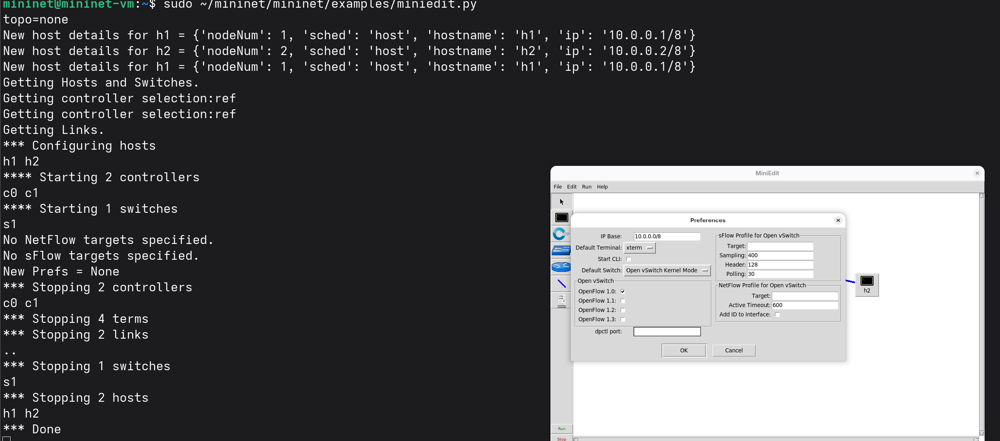{#fig-21 width=70%}

## Проверка автоматической адресации

- Топология запущена повторно.
- Хост `h1` получил адрес `15.0.0.1`.
- Хост `h2` получил адрес `15.0.0.2`.
- Маска сети: `255.0.0.0`.
- `IP Base` обеспечивает автоматическое назначение адресов.

---

{#fig-22 width=75%}

## Сохранение топологии

- Подготовлен рабочий каталог `~/work`.
- Топология сохранена в файл `lab01.mn`.

{#fig-23 width=70%}

## Открытие сохранённой топологии

- В MiniEdit открыт каталог `/home/mininet/work`.
- Выбран сохранённый файл `lab01.mn`.

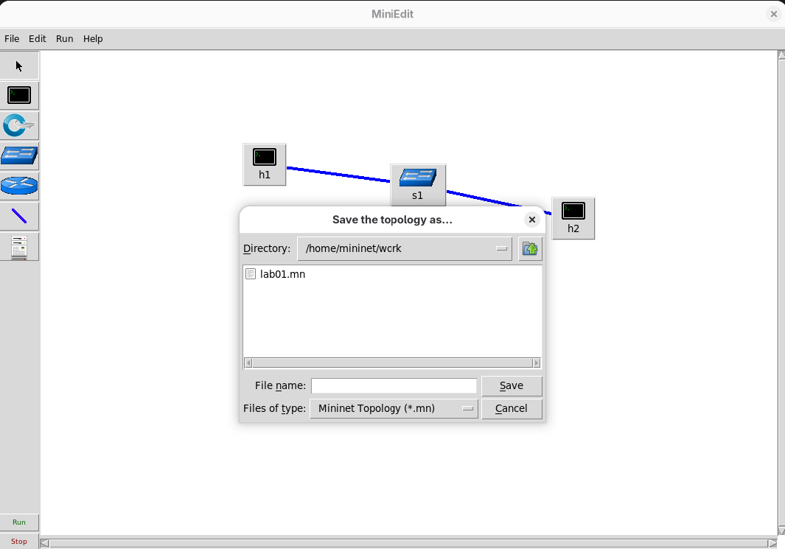{#fig-24 width=70%}

## Проверка загруженной топологии

- Файл `lab01.mn` успешно загружен.
- Восстановлены хосты `h1` и `h2`.
- Восстановлен коммутатор `s1`.
- Восстановлены соединения между узлами.

---

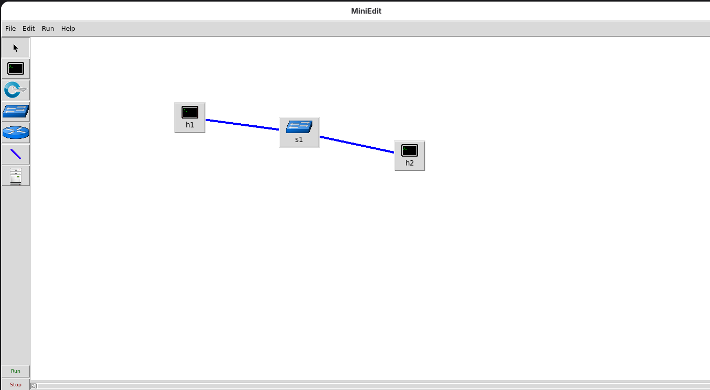{#fig-25 width=70%}

# Заключение

- Подготовлена среда Mininet.
- Создана топология из двух хостов и одного коммутатора.
- Проверены сетевые интерфейсы и связность хостов.
- Создана аналогичная топология в MiniEdit.
- IP-адреса настроены вручную и через `IP Base`.
- Топология сохранена в файл `lab01.mn`.
- Проверена повторная загрузка сохранённой топологии.