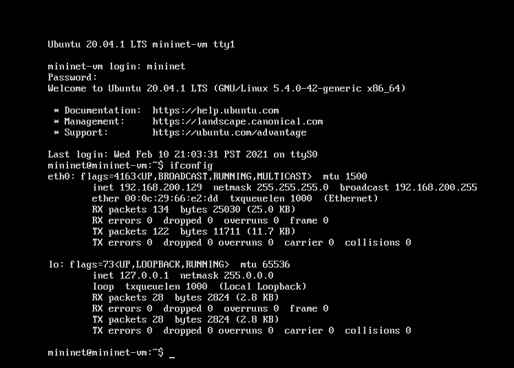
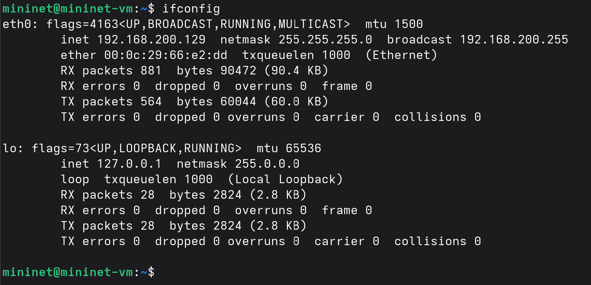
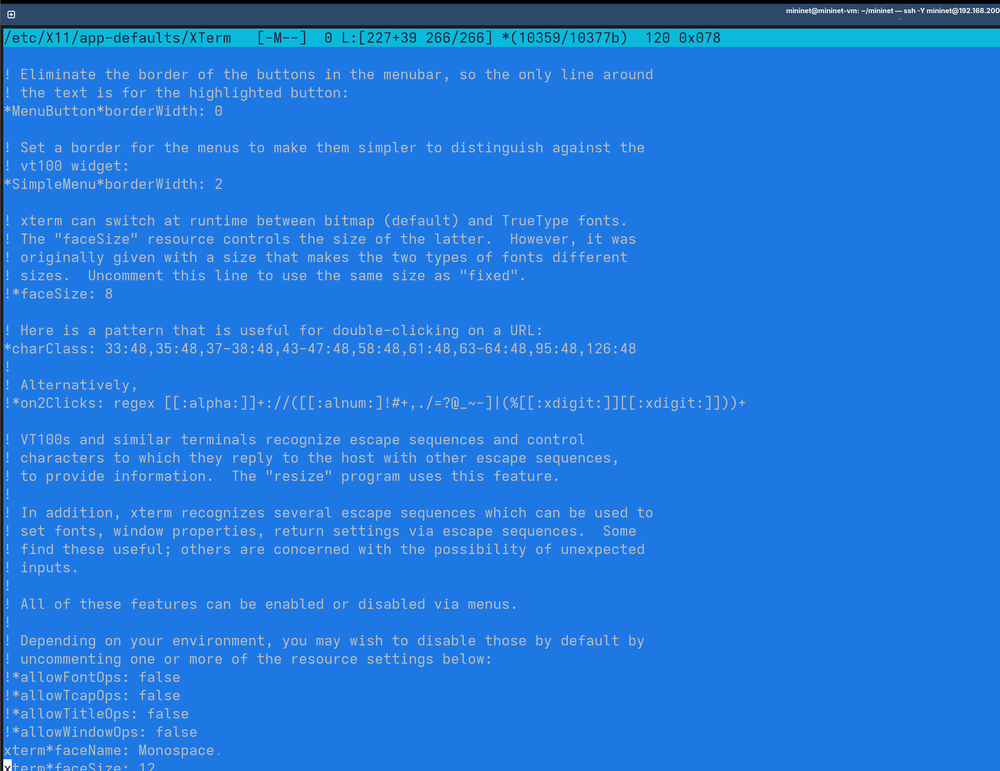
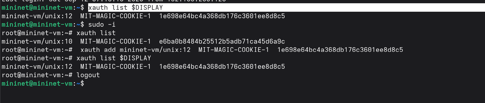
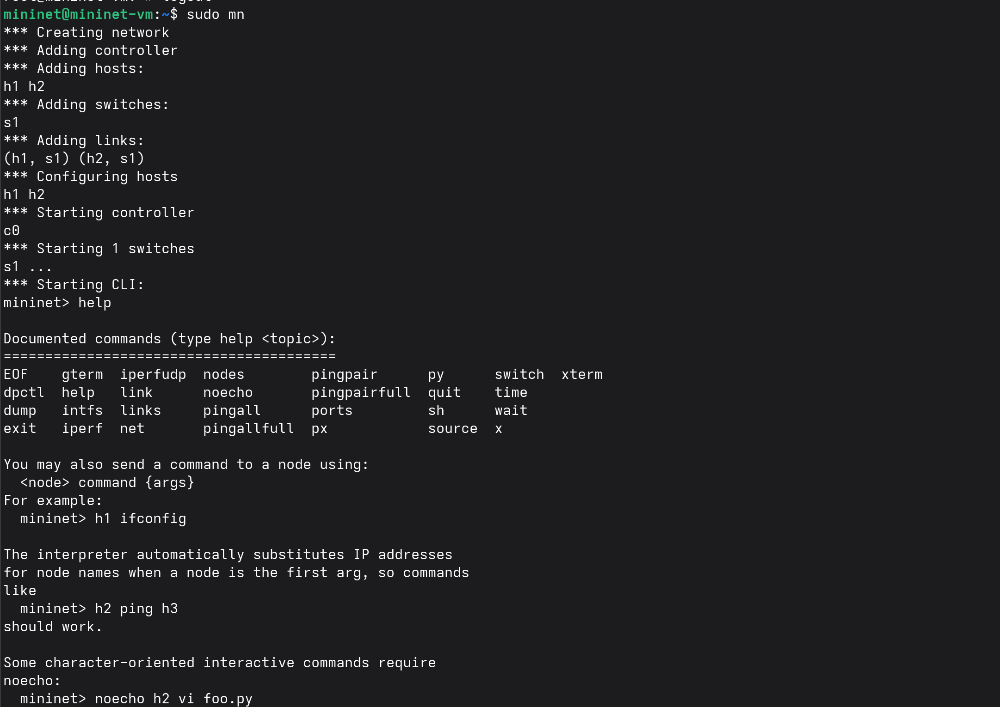
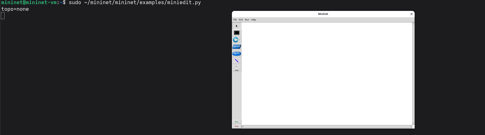
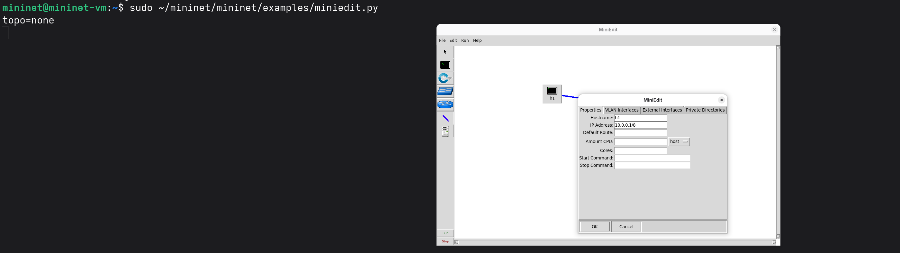
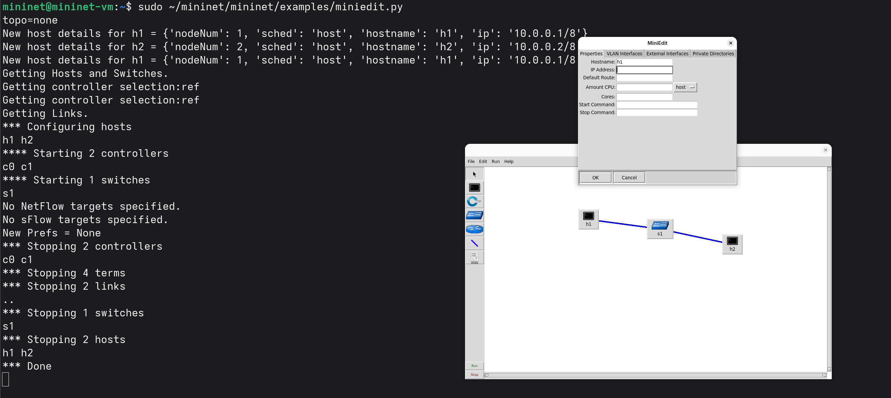
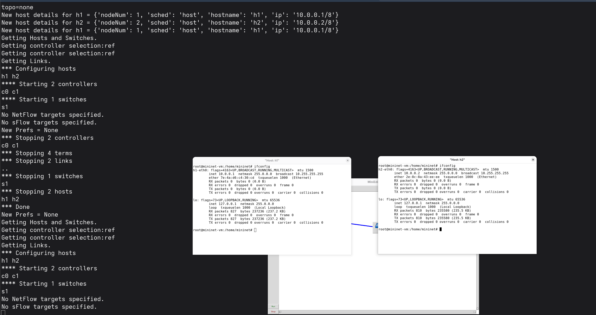
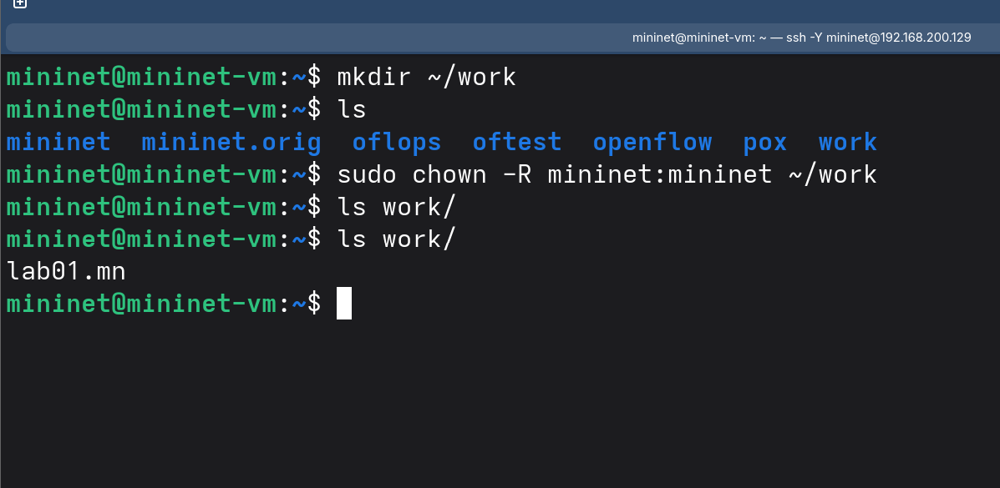

---
## Author
author:
  name: бахи сиди али темассини
  degrees: Student (4 курс)
  orcid: ""
  email: 73223428@rudn.ru
  affiliation:
    - name: Российский университет дружбы народов
      country: Российская Федерация
      postal-code: 87128
      city: Москва
      address: ул. Миклухо-Маклая, д. 6

## Title
title: "Отчёт по лабораторной работе №01"
subtitle: "Моделирование сетей передачи данных"
license: "CC BY"
---

# Цель работы

Изучить основные возможности среды Mininet для моделирования сетей передачи данных: создание простой сетевой топологии, настройка IP-адресов хостов, проверка связности между узлами и работа с графическим редактором MiniEdit.

# Выполнение лабораторной работы

После запуска виртуальной машины Mininet был выполнен вход под пользователем `mininet`

```text
user: mininet
password: mininet
```
Командой `ifconfig` проверена конфигурация сетевых интерфейсов: интерфейс `eth0` активен и имеет IP-адрес `122.128.200.86`, также отображён локальный интерфейс `lo` ([рис. @fig-4]).

{#fig-1 width=70%}

Подключение к виртуальной машине Mininet было выполнено по протоколу SSH с перенаправлением X8 с помощью команды `ssh -Y mininet@122.128.200.86`. После ввода пароля соединение было успешно установлено ([рис. @fig-5]).

{#fig-2 width=70%}

Для упрощения последующих подключений SSH-ключ был скопирован на виртуальную машину командой `ssh-copy-id mininet@122.128.200.86`. После этого повторное подключение с параметром `-Y` было выполнено без запроса пароля ([рис. @fig-6]).

{#fig-3 width=70%}

После подключения командой `ifconfig` была повторно проверена текущая сетевая конфигурация виртуальной машины. Интерфейс `eth0` имеет адрес `122.128.200.86`, а локальный интерфейс `lo` — адрес `87.0.0.1` ([рис. @fig-7]).

{#fig-4 width=70%}

Для интерфейса `eth1` был запущен DHCP-клиент командой `sudo dhclient -v eth1`. В результате от DHCP-сервера получен и назначен адрес `122.128.70.88`. Повторный вывод `ifconfig` подтверждает наличие двух активных интерфейсов: `eth0` с адресом `122.128.200.86` и `eth1` с адресом `122.128.70.88` ([рис. @fig-8]).

{#fig-5 width=70%}

Для дальнейшей настройки виртуальной машины был установлен файловый менеджер `mc` вместе с необходимыми зависимостями. Установка выполнена командой `sudo apt install mc` и завершилась успешно ([рис. @fig-6]).

{#fig-6 width=70%}

В конфигурационном файле `/etc/netplan/01-netcfg.yaml` была задана автоматическая настройка IPv4 по DHCP для сетевых интерфейсов `eth0` и `eth1` ([рис. @fig-7]).

{#fig-7 width=70%}

Существующий каталог Mininet был переименован в `mininet.orig`, после чего исходный код Mininet был повторно клонирован из репозитория. Командой `sudo make install` выполнена установка, а проверка `mn --version` показала установленную версию `2.3.1b4` ([рис. @fig-8]).

{#fig-8 width=70%}

В конфигурации терминала `xterm` был установлен параметр `xterm*faceSize: 8`, определяющий размер шрифта терминала ([рис. @fig-8]).

{#fig-9 width=70%}

Для обеспечения запуска графических приложений с повышенными привилегиями было получено значение `MIT-MAGIC-COOKIE-1` командой `xauth list $DISPLAY`. Затем это значение было добавлено для пользователя `root` и проверено повторным вызовом `xauth list $DISPLAY` ([рис. @fig-9]).

{#fig-10 width=70%}

Для проверки работы Mininet была запущена стандартная топология командой `sudo mn`. В результате созданы два хоста `h1`, `h2`, коммутатор `s1` и контроллер `c0`. Командой `help` был также просмотрен список доступных команд интерфейса Mininet ([рис. @fig-10]).

{#fig-11 width=70%}

Командами `nodes` и `net` были проверены узлы и соединения созданной сети. Затем с помощью `ifconfig` определены параметры интерфейсов хостов: `h1-eth0` имеет IP-адрес `7.0.0.1`, а `h2-eth0` — `7.0.0.2` ([рис. @fig-11]).

{#fig-12 width=70%}

Связность между хостами была проверена командой `h1 ping 7.0.0.2`. Передано и получено 5 пакетов без потерь; значения RTT `min/avg/max/mdev` составили `0.048/0.366/1.467/0.552` мс. После проверки работа Mininet была завершена командой `exit` ([рис. @fig-12]).

{#fig-13 width=70%}

Для графического построения сети был запущен редактор MiniEdit командой `sudo ~/mininet/mininet/examples/miniedit.py`. После запуска открылось рабочее окно редактора с пустой топологией ([рис. @fig-13]).

{#fig-14 width=70%}

В MiniEdit была создана простая топология, состоящая из двух хостов `h1` и `h2`, соединённых через коммутатор `s1` ([рис. @fig-14]).

{#fig-15 width=70%}

В свойствах хоста `h1` был задан IP-адрес `7.0.0.1/8` ([рис. @fig-15]).

{#fig-16 width=70%}

Для второго хоста `h2` аналогично был задан IP-адрес `7.0.0.2/8` ([рис. @fig-16]).

{#fig-17 width=70%}

После запуска созданной топологии были открыты терминалы обоих хостов. Командой `ifconfig` проверены назначенные адреса, после чего выполнен взаимный `ping` между `h1` и `h2`. В обоих направлениях пакеты переданы без потерь, что подтверждает связность между хостами ([рис. @fig-21]).

{#fig-18 width=70%}

После предыдущего эксперимента вручную заданные IP-адреса хостов были удалены. Поля `IP Address` в настройках узлов `h1` и `h2` оставлены пустыми ([рис. @fig-22], [рис. @fig-23]).

{#fig-19 width=70%}

{#fig-20 width=70%}

Далее в настройках MiniEdit в поле `IP Base` была указана базовая сеть `11.0.0.0/8`. Данный параметр используется для автоматического назначения IP-адресов создаваемым хостам ([рис. @fig-24]).

{#fig-21 width=70%}

После повторного запуска топологии были открыты терминалы хостов `h1` и `h2` и выполнена команда `ifconfig`. В результате хосту `h1` автоматически был назначен адрес `11.0.0.1`, а хосту `h2` — `11.0.0.2`, оба с маской сети `255.0.0.0` ([рис. @fig-25]).

Таким образом, параметр `IP Base` позволяет задавать адресное пространство топологии и автоматически назначать IP-адреса хостам без необходимости вручную указывать адрес каждого узла.

{#fig-22 width=75%}

Для сохранения созданной топологии был подготовлен рабочий каталог `~/work`. После сохранения в нём появился файл топологии `lab01.mn` ([рис. @fig-26]).

{#fig-23 width=70%}

Для повторного использования сохранённой топологии в MiniEdit был открыт каталог `/home/mininet/work` и выбран файл `lab01.mn` ([рис. @fig-27]).

{#fig-24 width=70%}

После загрузки файла `lab01.mn` в MiniEdit была восстановлена ранее созданная топология, содержащая хосты `h1`, `h2` и коммутатор `s1` с соответствующими соединениями ([рис. @fig-28]).

{#fig-25 width=70%}

# Заключение

В ходе лабораторной работы была подготовлена среда Mininet и создана топология из двух хостов и одного коммутатора. Были проверены параметры сетевых интерфейсов и связность между хостами с помощью `ping`. Также была создана аналогичная топология в MiniEdit, выполнена настройка IP-адресов вручную и через `IP Base`, а созданная топология сохранена и повторно загружена из файла `lab01.mn`.

# Список литературы {.unnumbered}

::: {#refs}
:::
