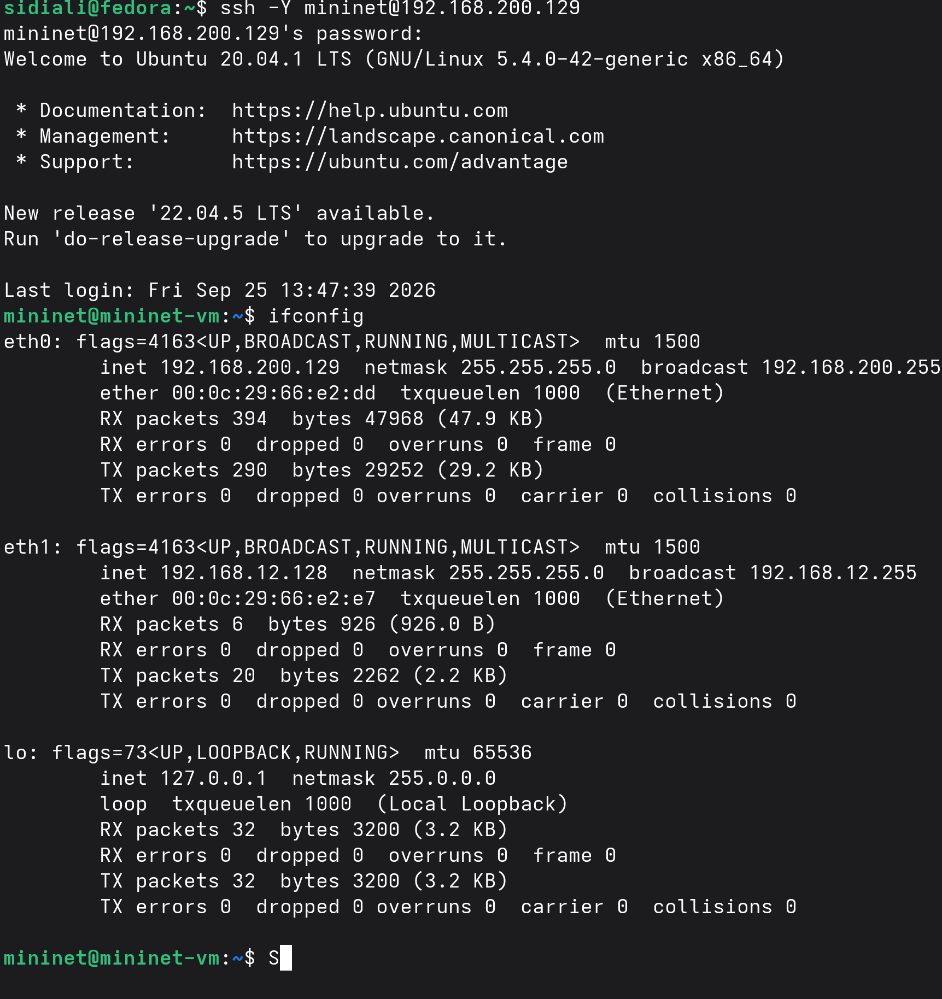
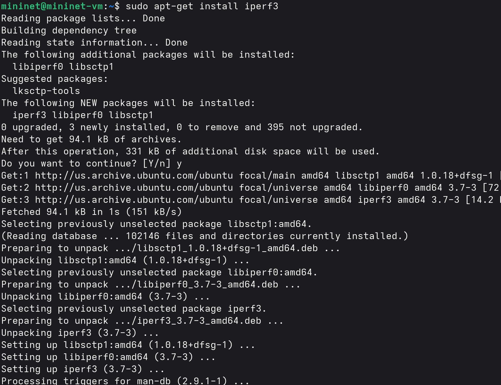
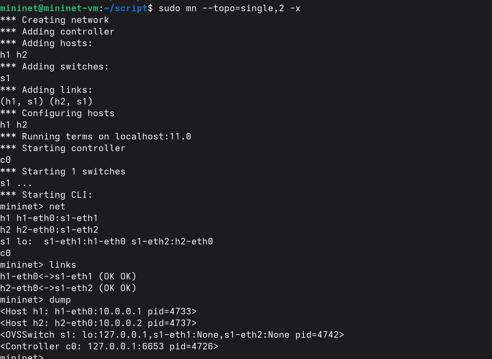
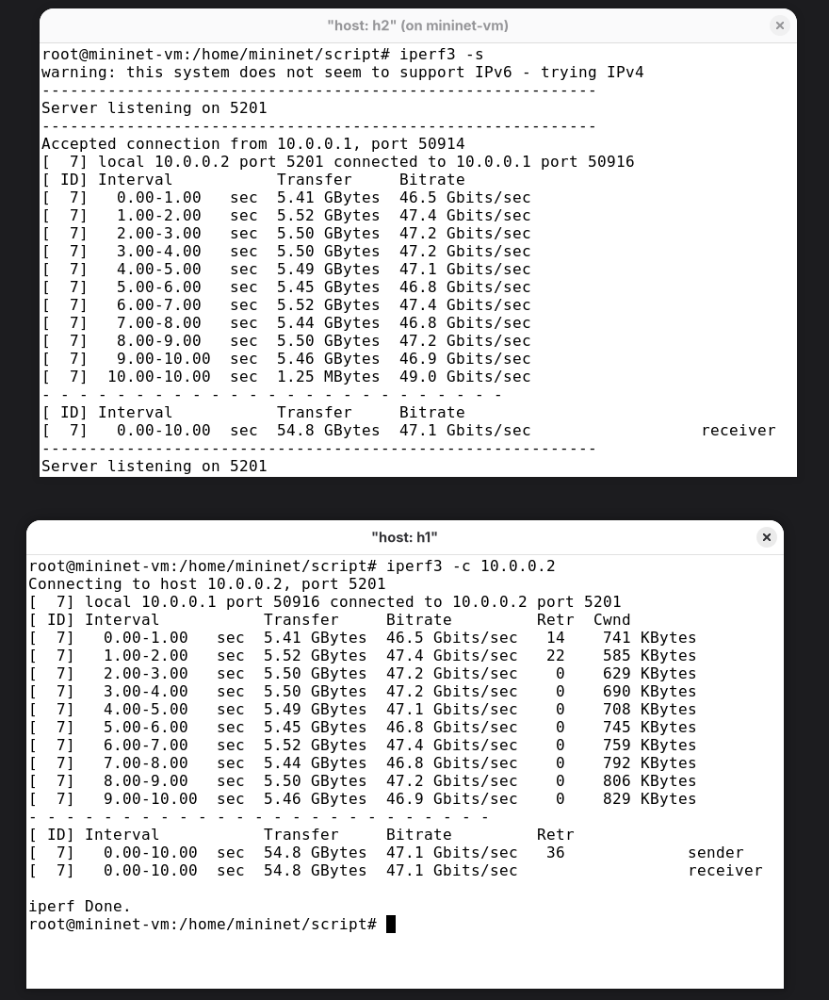
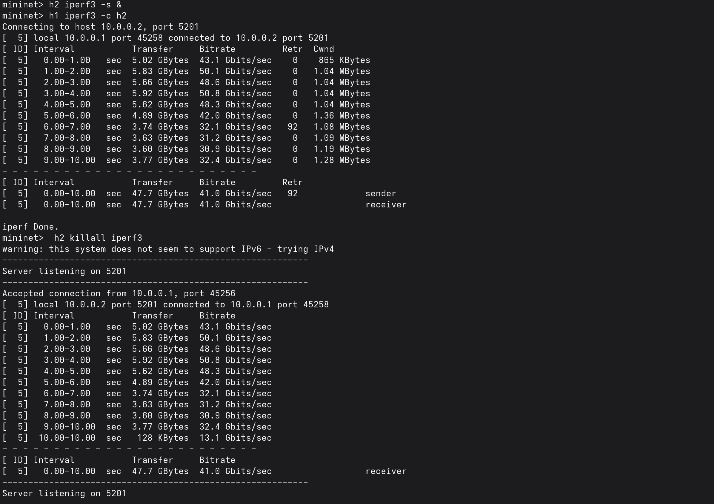
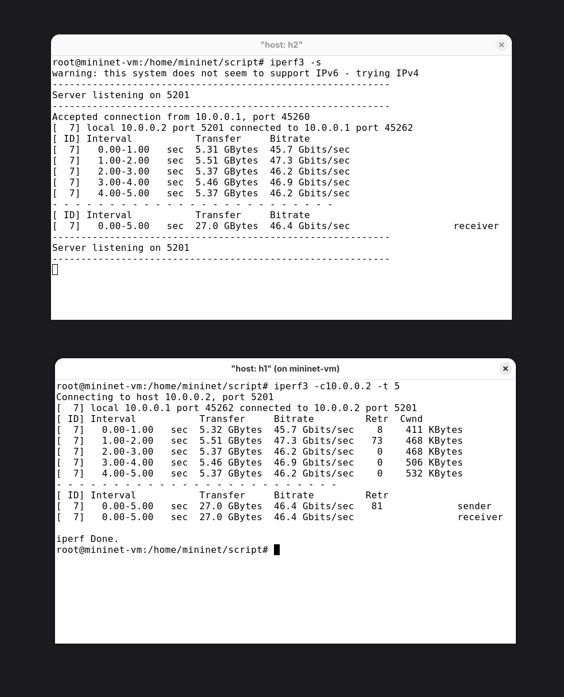
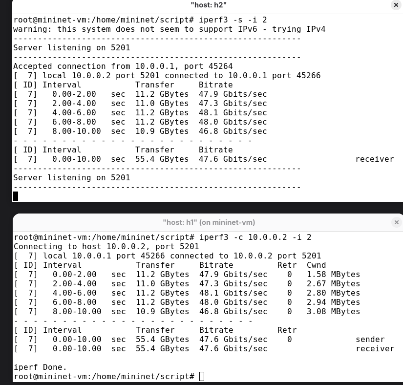
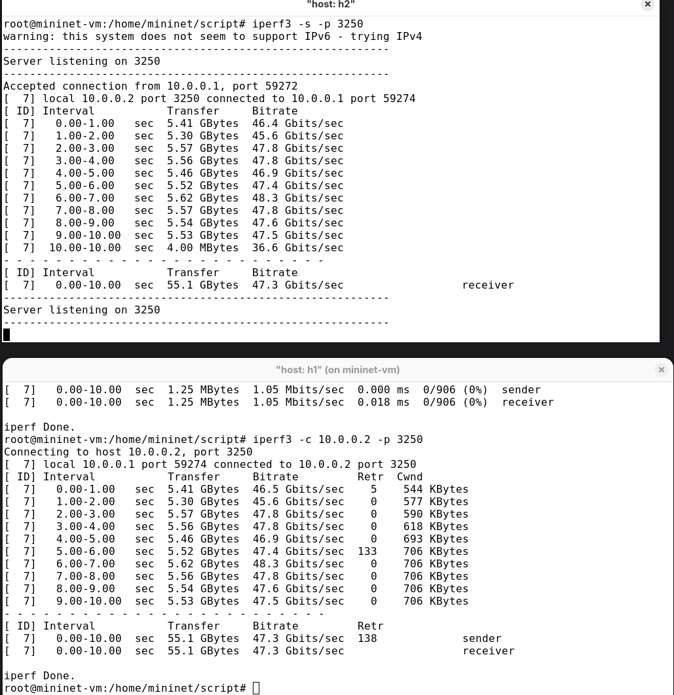
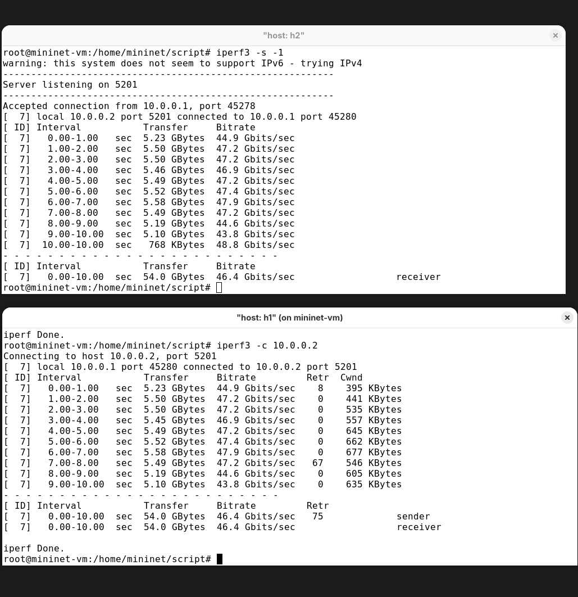
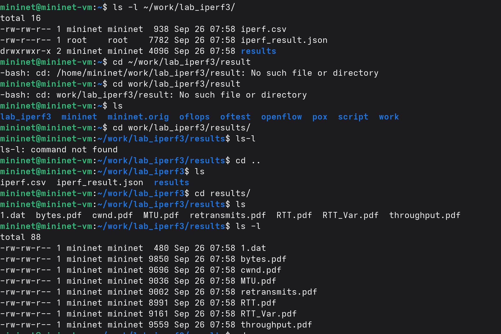

---
## Author
author:
  name: бахи сиди али темассини
  degrees: Student (4 курс)
  orcid: ""
  email: 1032234211@rudn.ru
  affiliation:
    - name: Российский университет дружбы народов
      country: Российская Федерация
      postal-code: 117198
      city: Москва
      address: ул. Миклухо-Маклая, д. 6
## Title
title: Лабораторная работа №02
subtitle: "Моделирование сетей передачи данных"
license: CC BY
date: today
date-format: "YYYY-MM-DD" 
---

# Информация

## Докладчик

:::::::::::::: {.columns align=center}
::: {.column width="70%"}

  - бахи сиди али темассини
  - Российский университет дружбы народов

:::
::: {.column width="30%"}

:::
::::::::::::::

# Цель работы

- Изучить основные возможности утилиты iPerf3.
- Освоить измерение характеристик сетевого соединения.
- Провести измерения в среде Mininet.
- Выполнить тесты с различными параметрами iPerf3.

# Выполнение лабораторной работы

## Подключение к виртуальной машине Mininet

- Выполнено подключение к виртуальной машине по протоколу SSH.
- Использована поддержка перенаправления X11.
- После подключения выполнена команда ifconfig.
- Просмотрены параметры сетевых интерфейсов виртуальной машины.

---

{#fig-1 width=70%}

## Установка iPerf3

- На виртуальной машине установлен инструмент iperf3.
- Дополнительно установлены необходимые программы:
  - git;
  - jq;
  - gnuplot-nox;
  - evince.
- Установленные инструменты используются для дальнейшего выполнения работы.

---

{#fig-2 width=70%}

## Проверка версии iPerf3

- После установки проверена версия iperf3.
- Установленная версия: iperf 3.7.

{#fig-3 width=70%}

## Установка iperf3_plotter

- Для визуализации результатов использован iperf3_plotter.
- Репозиторий iperf3_plotter клонирован во временный каталог.
- Необходимые скрипты скопированы в /usr/bin.
- Скрипты подготовлены для дальнейшей обработки результатов измерений.

{#fig-4 width=70%}

## Запуск топологии Mininet

- Запущена топология Mininet.
- Созданы два хоста: h1 и h2.
- Создан коммутатор s1.
- Командой net просмотрена структура сети.
- Командой links проверено состояние соединений.
- Командой dump просмотрены параметры узлов.
- Хосту h1 назначен адрес 10.0.0.1.
- Хосту h2 назначен адрес 10.0.0.2.

---

{#fig-5 width=70%}

## Первое измерение пропускной способности

- На хосте h2 запущен сервер iperf3.
- На хосте h1 запущен клиент iperf3.
- Клиент подключён к серверу по адресу 10.0.0.2.
- Выполнено измерение пропускной способности между хостами.

---

- ID — идентификатор соединения: 7.
- Interval — интервал вывода результатов: 1 секунда.
- Transfer — за тест передано 83,9 GBytes.
- Bitrate — средняя скорость составила 72,1 Gbits/sec.
- Продолжительность теста — 10 секунд.
- Retr — зарегистрировано 4046 повторных передач TCP-сегментов.
- Cwnd — размер окна перегрузки TCP.
- Итоговые значения клиента и сервера совпадают.

---

{#fig-6 width=70%}

## Запуск iPerf3 из командной строки Mininet

- Аналогичный тест выполнен непосредственно из Mininet.
- Сервер iperf3 запущен на хосте h2.
- Сервер работал в фоновом режиме.
- Клиент запущен на хосте h1.
- Выполнено подключение к серверу h2.
- Средняя скорость передачи: 71,9 Gbits/sec.

---

{#fig-7 width=70%}

## Изменение продолжительности тестирования

- Продолжительность теста изменена параметром -t 5.
- Использована команда:
  iperf3 -c 10.0.0.2 -t 5.
- Продолжительность передачи: 5 секунд.

---

- ID — идентификатор соединения: 7.
- Interval — результаты выводились каждую 1 секунду.
- Transfer — передано 41,6 GBytes.
- Bitrate — средняя скорость составила 71,5 Gbits/sec.
- Retr — зарегистрировано 1157 повторных передач.
- Cwnd — изменялся в процессе тестирования.
- Сервер и клиент получили одинаковые итоговые значения.

---

{#fig-8 width=70%}

## Изменение интервала вывода результатов

- Интервал вывода статистики изменён на 2 секунды.
- На сервере h2 выполнено:
  iperf3 -s -i 2.
- На клиенте h1 выполнено:
  iperf3 -c 10.0.0.2 -i 2.

---

- ID — идентификатор соединения: 7.
- Interval — интервалы 0–2, 2–4, 4–6, 6–8, 8–10 секунд.
- Transfer — всего передано 82,9 GBytes.
- За один интервал передавалось 16,4–16,9 GBytes.
- Bitrate — изменялся от 70,2 до 72,4 Gbits/sec.
- Средняя скорость — 71,2 Gbits/sec.
- Retr — зарегистрировано 1813 повторных передач.
- Cwnd — изменялся от 628 KBytes до 909 KBytes.
- Продолжительность теста — 10 секунд.
- Итоговые значения клиента и сервера совпадают.

---

{#fig-9 width=70%}

## Ограничение объёма передаваемых данных

- Объём передаваемых данных ограничен параметром -n.
- На клиенте выполнена команда:
  iperf3 -c 10.0.0.2 -n 16G.
- Тест завершился после передачи заданного объёма данных.

---

- ID — идентификатор соединения: 7.
- Interval — продолжительность передачи 1,91 секунды.
- Transfer — передано 16,0 GBytes.
- Bitrate — средняя скорость 71,9 Gbits/sec.
- Retr — зарегистрировано 1041 повторных передач.
- Cwnd — 718 KBytes в первом интервале.
- Cwnd — 612 KBytes во втором интервале.
- Клиент и сервер показали одинаковые итоговые результаты.

---

{#fig-10 width=70%}

## Тестирование протокола UDP

- Для передачи данных использован протокол UDP.
- На клиенте h1 выполнена команда:
  iperf3 -c 10.0.0.2 -u.
- Сервер h2 принимал UDP-трафик.
- Выполнен анализ статистики UDP-передачи.

---

- ID — идентификатор соединения: 7.
- Interval — тест выполнялся 10 секунд.
- Статистика выводилась каждую 1 секунду.
- Transfer — передано 1,25 MBytes.
- За интервал передавалось около 127–129 KBytes.
- Bitrate — средняя скорость 1,05 Mbits/sec.
- Total Datagrams — передано 906 UDP-датаграмм.
- Jitter — итоговое значение 0,027 ms.
- Lost/Total Datagrams — 0/906 (0%).
- Потери UDP-датаграмм отсутствовали.

---

{#fig-11 width=70%}

## Использование другого сетевого порта

- Проверена работа iperf3 через другой порт.
- На сервере h2 выполнено:
  iperf3 -s -p 3250.
- На клиенте h1 выполнено:
  iperf3 -c 10.0.0.2 -p 3250.
- Использован порт 3250 вместо стандартного 5201.

---

- ID — идентификатор соединения: 7.
- Port — соединение успешно установлено через порт 3250.
- Interval — тест выполнялся 10 секунд.
- Transfer — передано 87,1 GBytes.
- Bitrate — средняя скорость 74,8 Gbits/sec.
- Скорость по интервалам: примерно 74,0–76,2 Gbits/sec.
- Retr — зарегистрировано 4084 повторных передачи.
- Cwnd — изменялся примерно от 385 KBytes до 1,01 MBytes.
- Клиент и сервер получили одинаковые итоговые результаты.

---

{#fig-12 width=70%}

## Проверка параметра -1

- На сервере h2 выполнена команда:
  iperf3 -s -1.
- На клиенте h1 выполнено подключение к 10.0.0.2.
- Параметр -1 задаёт обслуживание одного клиентского соединения.
- После завершения соединения сервер автоматически прекращает работу.

---

- ID — идентификатор TCP-соединения: 7.
- Interval — тест выполнялся 10 секунд.
- Transfer — передано 82,2 GBytes.
- Bitrate — средняя скорость 70,6 Gbits/sec.
- Основной диапазон скорости: 71,4–73,2 Gbits/sec.
- В первом интервале получено 56,6 Gbits/sec.
- Retr — зарегистрировано 73 повторных передачи.
- Максимум повторных передач: 47 на интервале 8–9 секунд.
- Cwnd — в начале 2,31 MBytes.
- К концу Cwnd уменьшился примерно до 1,38 MBytes.
- Результаты клиента и сервера совпадают.
- После одного соединения сервер завершил работу.

---

{#fig-13 width=70%}

## Завершение сервера после одного соединения

- Сервер iperf3 на h2 запущен с параметром -1.
- Выполнено одно клиентское соединение.
- После завершения теста сервер остановлен автоматически.
- Продолжительность теста — 10 секунд.
- Передано 82,2 GBytes.
- Средняя скорость — 70,6 Gbits/sec.

---

{#fig-14 width=70%}

## Создание каталога результатов

- Для результатов создан отдельный каталог:
  ~/work/lab_iperf3.
- Наличие каталога проверено командой:
  ls -l ~/work.
- Каталог подготовлен для хранения результатов тестирования.

{#fig-15 width=70%}

## Сохранение результатов в JSON

- Выполнен очередной тест iperf3.
- Для экспорта результатов использован параметр -J.
- Вывод сохранён в файл iperf_result.json.
- Файл создан на хосте h1.
- Средняя скорость на сервере h2: 70,9 Gbits/sec.

---

{#fig-16 width=70%}

## Проверка файла результатов

- Проверено содержимое каталога ~/work/lab_iperf3.
- Файл iperf_result.json успешно создан.
- Размер файла: 7792 байта.
- Файл содержит результаты проведённого измерения.

---

{#fig-17 width=70%}

## Обработка результатов и построение графиков

- Изменены права владельца файлов в каталоге ~/work.
- Запущен скрипт plot_iperf.sh.
- Выполнена обработка данных из результатов iperf3.
- Создан файл iperf.csv.
- Создан каталог results.

---

- Получены графики в формате PDF:
  - bytes;
  - cwnd;
  - MTU;
  - retransmits;
  - RTT;
  - RTT_Var;
  - throughput.

---

{#fig-18 width=70%}

# Заключение

- Изучены основные возможности iPerf3.
- Выполнены измерения между хостами сети Mininet.
- Проведены тесты с использованием TCP и UDP.
- Изменена продолжительность тестирования.
- Изменён интервал вывода статистики.
- Проверено ограничение объёма передаваемых данных.
- Проверена работа через нестандартный сетевой порт.
- Проверена работа сервера с параметром -1.
- Результаты сохранены в формате JSON.
- Данные обработаны с помощью iperf3_plotter.
- Получены файлы с графиками результатов измерений.
- Поставленная цель лабораторной работы достигнута.
