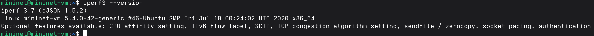
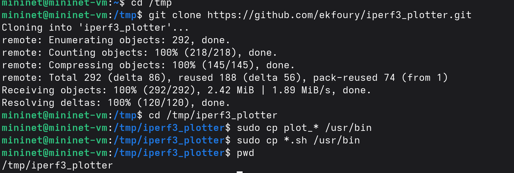
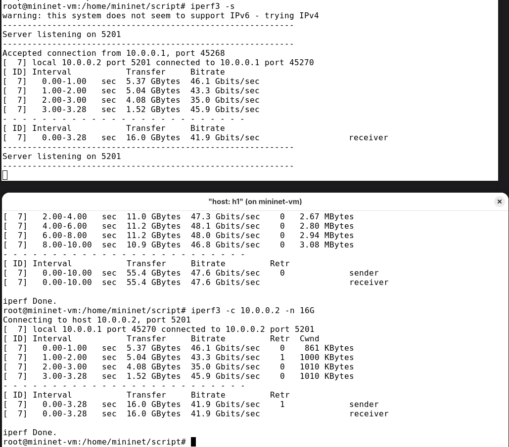
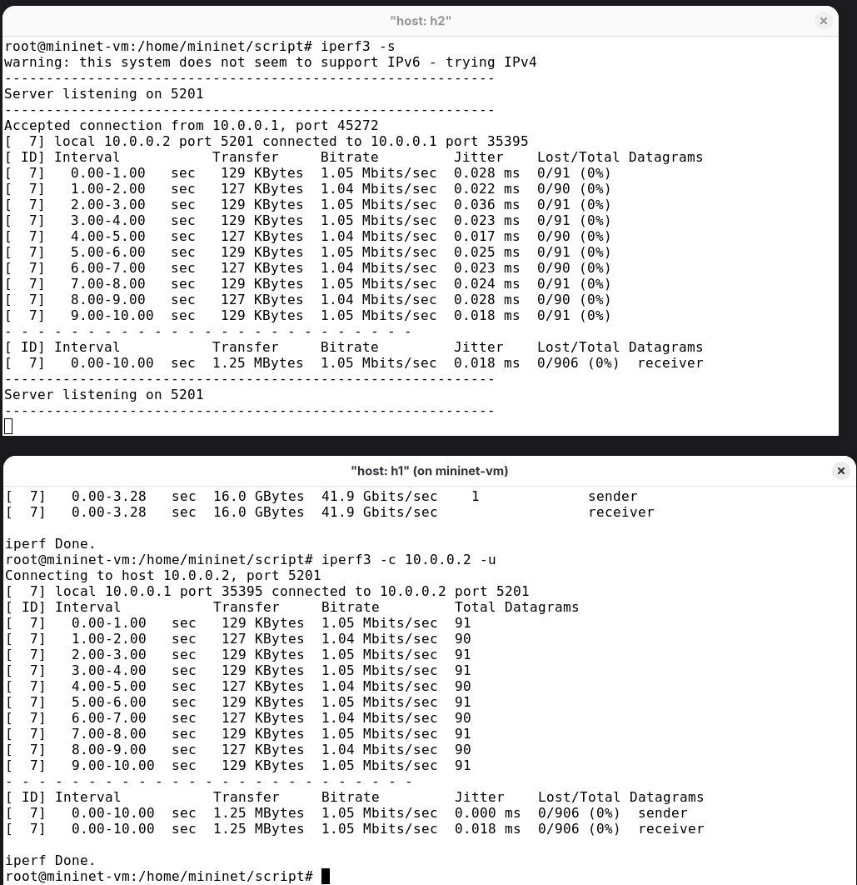
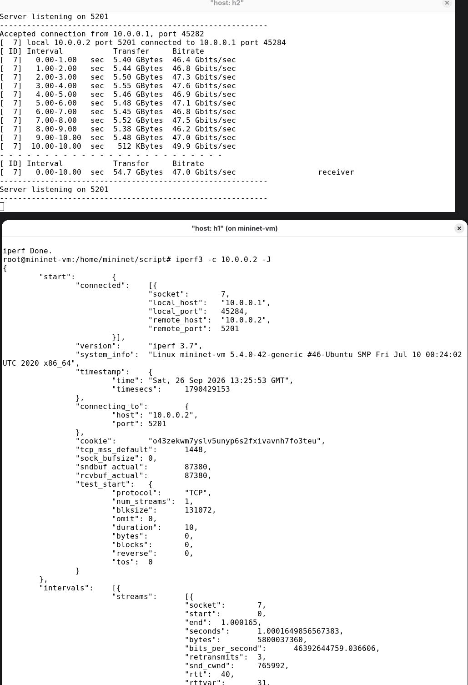
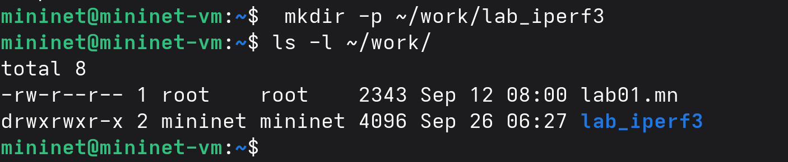
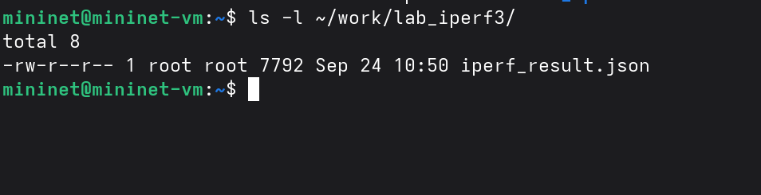

---
## Author
author:
  name: бахи сиди али темассини
  degrees: Student (4 курс)
  orcid: ""
  email: 1032234211@rudn.ru
  affiliation:
    - name: Российский университет дружбы народов
      country: Российская Федерация
      postal-code: 117198
      city: Москва
      address: ул. Миклухо-Маклая, д. 6

## Title
title: "Отчёт по лабораторной работе №02"
subtitle: "Моделирование сетей передачи данных"
license: "CC BY"
---

# Цель работы

Изучить основные возможности утилиты iPerf3 для измерения характеристик сетевого соединения в среде Mininet и освоить проведение тестов с различными параметрами.

# Выполнение лабораторной работы

Было выполнено подключение к виртуальной машине Mininet по протоколу SSH с поддержкой X11. После подключения с помощью команды ifconfig были просмотрены параметры сетевых интерфейсов виртуальной машины ([рис. @fig-1]).

{#fig-1 width=70%}

На виртуальной машине был установлен инструмент iperf3, а также дополнительное программное обеспечение git, jq, gnuplot-nox и evince, необходимое для дальнейшего выполнения работы ([рис. @fig-2]).

{#fig-2 width=70%}

После установки была выполнена проверка версии iperf3. В результате установлена версия iperf 3.7 ([рис. @fig-3]).

{#fig-3 width=70%}

Для визуализации результатов измерений во временный каталог был клонирован репозиторий iperf3_plotter. Затем необходимые скрипты были скопированы в каталог /usr/bin ([рис. @fig-4]).

{#fig-4 width=70%}

Для проведения экспериментов была запущена топология Mininet из двух хостов h1, h2 и коммутатора s1. Командами net, links и dump были просмотрены структура сети, состояние соединений и параметры созданных узлов. Хостам назначены адреса 10.0.0.1 и 10.0.0.2 ([рис. @fig-5]).

{#fig-5 width=70%}

Для измерения пропускной способности между хостами h1 и h2 на узле h2 был запущен сервер iperf3,  а на h1 — клиент с подключением к адресу 10.0.0.2 ([рис. @fig-6]):

- ID — идентификационный номер соединения. В данном тесте используется соединение с ID 7.
- Interval — временной интервал, за который выводятся результаты измерения. По умолчанию он составляет 1 секунду.
- Transfer — объём данных, переданных за каждый временной интервал. За весь тест было передано 83,9 GBytes.
- Bitrate — измеренная пропускная способность соединения. Среднее значение за 10 секунд составило 72,1 Gbits/sec.
- Retr — количество повторно переданных TCP-сегментов. За весь тест на стороне клиента зарегистрировано 4046 повторных передач.
- Cwnd — размер окна перегрузки TCP для каждого временного интервала, ограничивающий объём данных, который клиент может отправить до получения подтверждения.
- Итоговые результаты — тест продолжался 10 секунд; значения Transfer и Bitrate в итоговом отчёте сервера соответствуют значениям на стороне клиента.

{#fig-6 width=70%}

Аналогичное измерение было выполнено непосредственно из командной строки Mininet. Сервер iperf3 запущен на h2 в фоновом режиме, после чего с h1 выполнено подключение к серверу. Средняя скорость передачи составила 71,9 Gbits/sec ([рис. @fig-7]).

{#fig-7 width=70%}

Далее продолжительность тестирования была ограничена пятью секундами с помощью параметра -t 5. За указанное время было передано 41,6 GBytes данных со средней скоростью 71,5 Gbits/sec ([рис. @fig-8]).

Для изменения продолжительности тестирования была выполнена команда iperf3 -c 10.0.0.2 -t 5, задающая время передачи данных 5 секунд. После завершения теста получены следующие результаты ([рис. @fig-8]):

- ID — идентификатор соединения 7.
- Interval — тест выполнялся в течение 5 секунд, при этом результаты выводились с интервалом 1 секунда.
- Transfer — за всё время тестирования было передано 41,6 GBytes данных.
- Bitrate — средняя пропускная способность за 5 секунд составила 71,5 Gbits/sec.
- Retr — на стороне клиента зафиксировано 1157 повторно переданных TCP-сегментов.
- Cwnd — размер окна перегрузки изменялся в процессе теста; в отчёте представлены значения для каждого секундного интервала.
- Итоговые результаты — на стороне сервера также получены 41,6 GBytes и 71,5 Gbits/sec, что соответствует итоговым значениям клиента.

{#fig-8 width=70%}

Для изменения интервала вывода промежуточных результатов iPerf3 на сервере h2 была выполнена команда iperf3 -s -i 2, а на клиенте h1 — iperf3 -c 10.0.0.2 -i 2. В результате статистика выводилась каждые 2 секунды ([рис. @fig-9]):

- ID — идентификатор соединения 7.
- Interval — результаты представлены с интервалом 2 секунды: 0–2, 2–4, 4–6, 6–8 и 8–10 секунд.
- Transfer — за весь тест было передано 82,9 GBytes данных. За отдельные двухсекундные интервалы передавалось от 16,4 до 16,9 GBytes.
- Bitrate — пропускная способность изменялась от 70,2 до 72,4 Gbits/sec, а среднее значение за весь тест составило 71,2 Gbits/sec.
- Retr — на стороне клиента за весь тест зарегистрировано 1813 повторно переданных TCP-сегментов.
- Cwnd — размер окна перегрузки изменялся в каждом интервале и составлял от 628 KBytes до 909 KBytes.
- Итоговые результаты — тест продолжался 10 секунд; клиент и сервер показали одинаковые итоговые значения: 82,9 GBytes переданных данных и 71,2 Gbits/sec пропускной способности.

{#fig-9 width=70%}

Для ограничения объёма передаваемых данных на клиенте h1 была выполнена команда iperf3 -c 10.0.0.2 -n 16G. Тест завершился после передачи заданного объёма 16 GBytes ([рис. @fig-10]):

- ID — идентификатор соединения 7.
- Interval — передача данных продолжалась 1,91 секунды.
- Transfer — суммарно было передано 16,0 GBytes, что соответствует значению, заданному параметром -n 16G.
- Bitrate — средняя пропускная способность за весь тест составила 71,9 Gbits/sec.
- Retr — на стороне клиента зафиксировано 1041 повторно переданных TCP-сегментов.
- Cwnd — размер окна перегрузки составлял 718 KBytes в первом интервале и 612 KBytes во втором.
- Итоговые результаты — сервер и клиент показали одинаковые итоговые значения: 16,0 GBytes переданных данных и 71,9 Gbits/sec пропускной способности.

{#fig-10 width=70%}

Для измерения параметров передачи по протоколу UDP на клиенте h1 была выполнена команда iperf3 -c 10.0.0.2 -u. Сервер h2 принимал UDP-трафик и отображал статистику передачи ([рис. @fig-11]):

- ID — идентификатор соединения 7.
- Interval — тест выполнялся в течение 10 секунд, результаты выводились с интервалом 1 секунда.
- Transfer — за весь тест было передано 1,25 MBytes данных; за каждый интервал передавалось примерно 127–129 KBytes.
- Bitrate — средняя пропускная способность составила 1,05 Mbits/sec.
- Total Datagrams — за время теста было передано 906 UDP-датаграмм.
- Jitter — на стороне получателя итоговое значение джиттера составило 0,027 ms.
- Lost/Total Datagrams — сервер получил данные без потерь: 0/906 (0%).
- Итоговые результаты — за 10 секунд передано 1,25 MBytes со средней скоростью 1,05 Mbits/sec; потери UDP-датаграмм отсутствовали.

{#fig-11 width=70%}

Для проверки работы iPerf3 с другим сетевым портом на сервере h2 была выполнена команда iperf3 -s -p 3250, а на клиенте h1 — iperf3 -c 10.0.0.2 -p 3250. Таким образом, соединение было установлено через порт 3250 вместо стандартного порта 5201 ([рис. @fig-12]):

- ID — идентификатор соединения 7.
- Port — сервер прослушивал порт 3250, и клиент успешно подключился к этому порту.
- Interval — тест выполнялся в течение 10 секунд, результаты выводились с интервалом 1 секунда.
- Transfer — за весь тест было передано 87,1 GBytes данных.
- Bitrate — средняя пропускная способность составила 74,8 Gbits/sec; по отдельным интервалам она находилась примерно в диапазоне 74,0–76,2 Gbits/sec.
- Retr — на стороне клиента за весь тест зарегистрировано 4084 повторно переданных TCP-сегмента.
- Cwnd — размер окна перегрузки изменялся в процессе теста примерно от 385 KBytes до 1,01 MBytes.
- Итоговые результаты — клиент и сервер показали одинаковые итоговые значения: 87,1 GBytes переданных данных и 74,8 Gbits/sec пропускной способности.

{#fig-12 width=70%}

Для проверки параметра -1 на сервере h2 была выполнена команда iperf3 -s -1, а на клиенте h1 — iperf3 -c 10.0.0.2. Параметр -1 задаёт завершение работы сервера после обслуживания одного клиентского соединения ([рис. @fig-13]):

- ID — идентификатор TCP-соединения равен 7.
- Interval — тест выполнялся в течение 10 секунд, при этом статистика выводилась с интервалом 1 секунда.
- Transfer — за весь период тестирования было передано 82,2 GBytes данных.
- Bitrate — средняя пропускная способность составила 70,6 Gbits/sec. В течение основных интервалов она находилась примерно в диапазоне 71,4–73,2 Gbits/sec, при этом в первом интервале было получено 56,6 Gbits/sec.
- Retr — за весь тест на стороне клиента зарегистрировано 73 повторно переданных TCP-сегмента. Наибольшее значение наблюдалось в интервале 8,00–9,00 сек — 47 повторных передач.
- Cwnd — размер окна перегрузки изменялся в процессе тестирования. В начале он составлял 2,31 MBytes, а к концу теста уменьшился примерно до 1,38 MBytes.
- Результат на клиенте — за 10 секунд передано 82,2 GBytes со средней скоростью 70,6 Gbits/sec.
- Результат на сервере — получено 82,2 GBytes со средней пропускной способностью 70,6 Gbits/sec, что соответствует результатам клиента.
- Работа параметра -1 — после завершения единственного тестового соединения сервер iPerf3 прекратил работу и вернулся к командной строке на h2. Таким образом, параметр -1 был успешно проверен.

{#fig-13 width=70%}

сервер iperf3 был запущен на h2 с параметром -1. После выполнения одного клиентского соединения сервер завершил работу. За 10 секунд было передано 82,2 GBytes со средней скоростью 70,6 Gbits/sec ([рис. @fig-14]).

{#fig-14 width=70%}

Для сохранения результатов измерений был создан отдельный каталог ~/work/lab_iperf3. Наличие каталога проверено командой ls -l ~/work ([рис. @fig-15]).

{#fig-15 width=70%}

Результат очередного теста iPerf3 был сохранён на хосте h1 в формате JSON с помощью параметра -J и перенаправления вывода в файл iperf_result.json. На стороне сервера h2 средняя скорость при этом измерении составила 70,9 Gbits/sec ([рис. @fig-16]).

{#fig-16 width=70%}

После завершения измерения было проверено содержимое каталога ~/work/lab_iperf3. В нём был создан файл iperf_result.json размером 7792 байта ([рис. @fig-17]).

{#fig-17 width=70%}

Для обработки сохранённых данных были изменены права владельца файлов в каталоге ~/work, после чего выполнен скрипт plot_iperf.sh. После успешного запуска были созданы файл iperf.csv и каталог results, содержащий файлы с графиками параметров bytes, cwnd, MTU, retransmits, RTT, RTT_Var и throughput в формате PDF ([рис. @fig-18]).

{#fig-18 width=70%}

# Заключение

В ходе лабораторной работы были изучены основные возможности iPerf3 и выполнены измерения между хостами сети Mininet. Были проведены тесты с различными параметрами TCP и UDP, изменены длительность, интервал вывода и порт соединения. Результаты измерений были сохранены в формате JSON и обработаны с помощью iperf3_plotter для получения файлов с графиками. Таким образом, поставленная цель лабораторной работы была достигнута.

